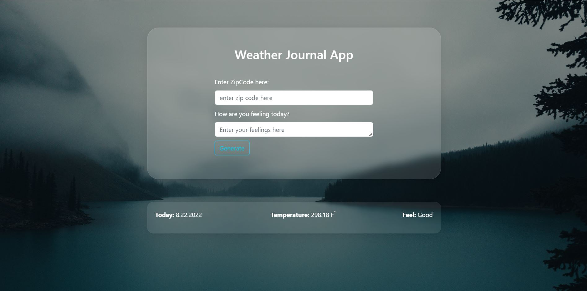

# Weather Journal App ☔

This project requires to create an asynchronous web app that uses Web API and user data to dynamically update the UI for a Weather-Journal App.
Project Specification [here](https://classroom.udacity.com/nanodegrees/nd0011-fwd-t2/parts/cd0429/modules/d153872b-b417-4f32-9c77-d809dc21581d/lessons/ls1847/concepts/8cc4833b-e747-44be-8556-b378a1f5f04e)

# Application Languages and Dependencies

- HTML, CSS and JavaScript
- Node.js
- Express

# View

